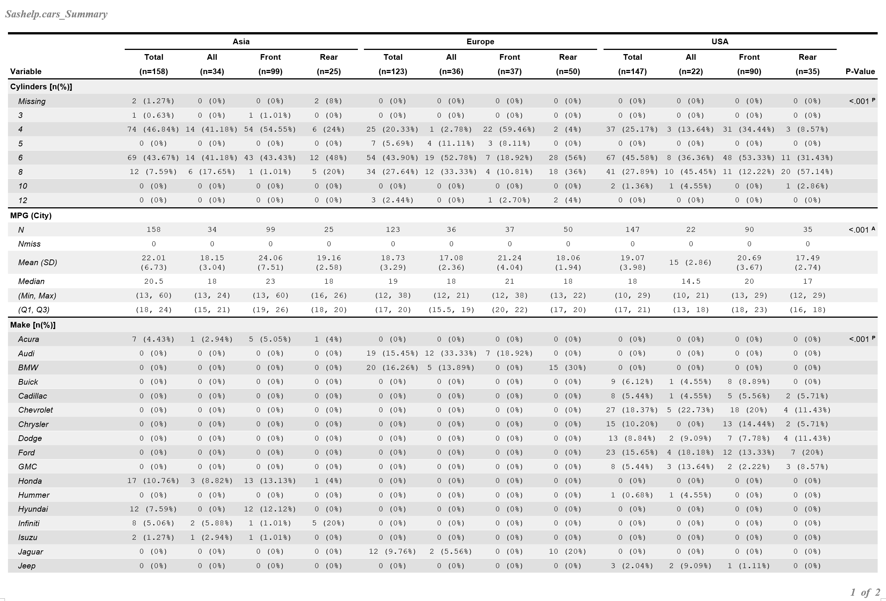

# 
This macro is a quick screening tool to examine the basic information in outcome variable(s) and to facilitate the detection of potential outliers/errors, trend or patterns of the data. 

It generates a publication quality table for a list of variables in one run and the outputs include univariate descriptive statistics and the across-group comparison analysis results customized to the appropriate data type.

The macro provides a lot of flexibilities in the outputs. 

* The outcome variable can be either continuous or categorical. 
* The analyses methods are automatically adjusted to fit the data type. 
* The user can select more or fewer numbers of basic summary statistics to report (All statistic-keywords in SAS proc means except CLM). 
* The output can be further stratified by a second or more group variable. 
* The outcome variable list may include only one variable or it can be extended to a long list of variables with mixed data types. 
* The number of digits displayed can be modified to meet any publication requirements. 
* The paper size, font size, text shadow and line style in the report can be customized.

For more information on the output table format and how to apply this macro to your dataset to expedite your exploratory analysis work, pleases check the output example and the code in Main.sas.

**Sample Result**:

  <b>Two groups in top level.</b> 
  <b3>(row shadow only)</b3> 
  

  <b>Three groups in top level.</b> 
  <b3>(row & block shadow)</b3> 
  

  <b>Three nested group levels.</b> 
  <b3>(no shadow & another report style)</b3> 
  

